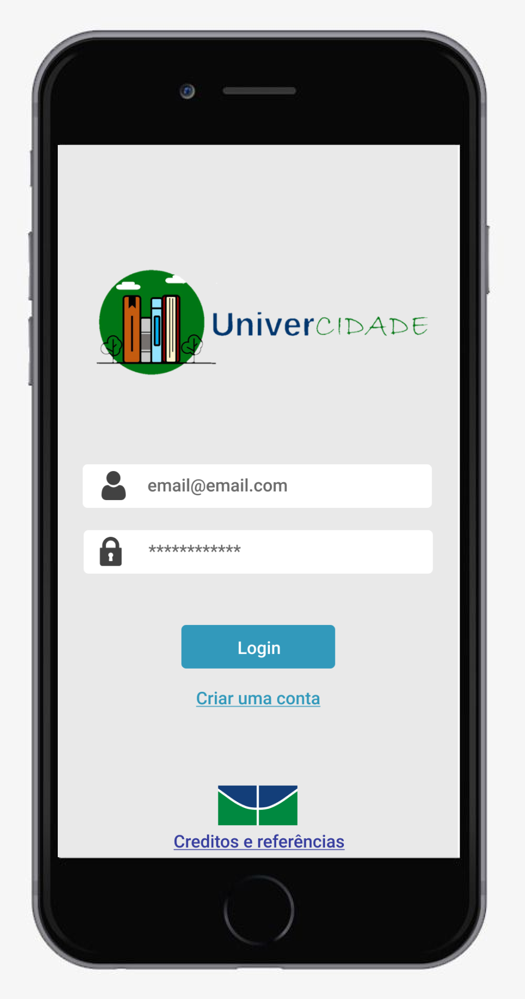

# Equipe - MaisSocial

## Projeto UniverCidade

### Decisão do problema a enfrentar

**Os tópicos abordados no projeto são**

- Necessidade de distanciamento físico constante entre as pessoas (formação de comportamentos e planejamento físico/ambiental)
- Solução de inclusão para grupos com dificuldades de acompanhar as atividades universitárias

### Descrição

O objetivo do projeto é mediar a implementação de uma rede colaborativa para disponibilizar acesso aos espaços e às tecnologias adequados aos estudos.

Para uma descrição detalahada do processo confira os documentos:
- [Documento](docs/Projeto_MaisSocial_UniverCidade.pdf)
- [Apresentação](docs/UniverCidade.pdf)

### Pitch 

### Aplicativo

Para a reserva dos locais de estudo será usado como auxílio um App para reservas. Foi desenvolvido um protótipo de alta fidelidade  que pode ser acessado no link: [Protótipo](https://www.figma.com/proto/I96PeBKolDmdZDEeHhNNiH/Reserva-de-hor%C3%A1rio-biblioteca?node-id=103%3A5&scaling=scale-down)

    

